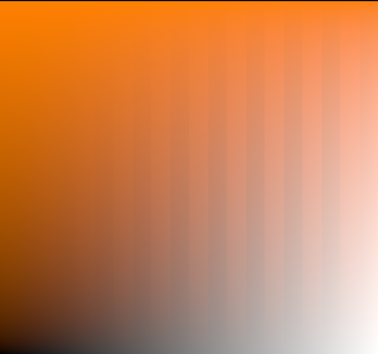

# An exploration of blending inspired by Kubelka-Munk theory

This is a quick sketch of an idea I had: compositing operator similar to the Porter-Duff "over" operator, but based on Kubelka-Munk theory.

If you run it, it writes an image such as the following to `out.png`:

This shows a gradient of a solid color (orange) with varying alpha over a gradient from black to white. There are alternating vertical stripes of Porter-Duff [alpha compositing] and the new compositing operator. They are similar, but the new one tends to be a little darker and less saturated, especially when composited over lighter colors (it is identical over black).

A good introduction to Kubelka-Munk theory in the context of compositing is [Computer-Generated Watercolor].

I hope to do a more complete explanation at some point, but will explain the basic idea here. Each layer being composited is a thin film of material that, for each channel of red, green, and blue scatters some of the light, absorbs some of the light, and lets some through. For a color + alpha combination, these relative fractions are computed to give the same results as Porter-Duff when composited over a black or white background.

The composition operator is designed to be a simple physical model. Some light is immediately scattered by the top layer, and some is absorbed. Of the light that is transmitted, again some is absorbed and some is transmitted. The light that is scattered bounces up to the top layer, and this bouncing may happen any number of times.

As with Porter-Duff, the composition operator is associative, and behaves similarly in other ways.

One observation: as the linked watercolor paper emphasizes, actual paints can vary in their transparency vs scattering. A transparent paint (like many high quality watercolors) becomes darker the more it's applied, while an opaque paint (like most paints mixed with white) quickly converges on its characteristic color. This effect is actually somewhat orthogonal to trying to model the physics of scattering using Kubelka-Munk. Porter-Duff compositing is similar to opaque paints, while the effect of fully transparent paints is captured with the "multiply" [blend mode][Blend modes]. A useful generalization of Porter-Duff is per-channel alpha, which captures all of this as well as "screen" modes (which are similar to "interference" watercolors), and also has value preserving RGB [subpixel rendering] in composition.

As I say, this deserves a more extensive write-up, with lots of visual examples. Perhaps some day soon.

## License

Licensed under either of
  * Apache License, Version 2.0 ([LICENSE-APACHE](LICENSE-APACHE) or
    http://www.apache.org/licenses/LICENSE-2.0)
  * MIT license ([LICENSE-MIT](LICENSE-MIT) or
    http://opensource.org/licenses/MIT) at your option.

[alpha compositing]: https://en.wikipedia.org/wiki/Alpha_compositing
[Computer-Generated Watercolor]: https://grail.cs.washington.edu/projects/watercolor/
[Blend modes]: https://en.wikipedia.org/wiki/Blend_modes
[Subpixel rendering]: https://en.wikipedia.org/wiki/Subpixel_rendering
